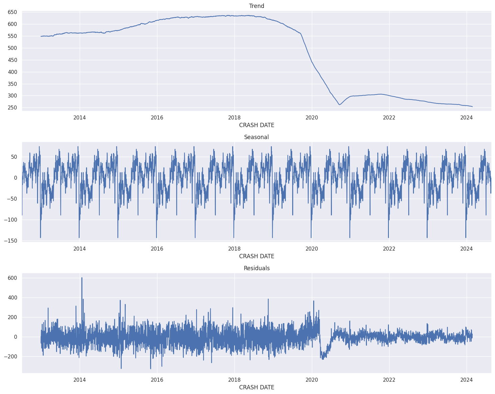

# 🚗 NYC Motor Vehicle Collisions Analysis

This project analyzes motor vehicle collisions in New York City using historical crash data. The analysis uncovers trends, seasonal patterns, and anomalies, helping identify how collisions evolved over time, especially in light of events like the COVID-19 pandemic.



---

## 📊 Overview

- **Dataset**: [NYC Open Data Portal](https://data.cityofnewyork.us/Transportation/Motor-Vehicle-Collisions-Crashes/h9gi-nx95)
- **Time Period**: 2012–2024
- **Focus Areas**:
  - Collision trends across years
  - Common contributing factors
  - Temporal patterns (seasonal/trend decomposition)
  - COVID-19's impact on traffic incidents

---

## 🧪 Project Workflow

1. **Data Loading**: NYC crash data imported using `pandas`
2. **Cleaning**: Handled nulls, standardized timestamps, extracted features (year, month)
3. **EDA**: Visualized top causes, borough-wise stats, and monthly distribution
4. **Time Series Analysis**: Applied seasonal decomposition to identify:
   - Long-term trends
   - Weekly/monthly seasonality
   - Residual outliers (unexpected spikes/dips)

---

## 📌 Tools Used

- Python 🐍
- Jupyter Notebook
- `pandas`, `matplotlib`, `seaborn` – for analysis and plots
- `statsmodels` – for time series decomposition
- `folium` – for mapping 

---

## 📷 Visualization Highlight

The plot above demonstrates time series decomposition on the daily number of collisions:
- **Trend**: Decline post-2020 due to lockdowns
- **Seasonality**: Weekly patterns visible across years
- **Residuals**: Outliers due to specific events or anomalies

---

## 🚀 How to Run

1. Clone the repo
2. Open the notebook in Jupyter
3. Ensure the dataset CSV is in the same directory
4. Run the notebook step-by-step

```bash
git clone https://github.com/yashling/NYC-Collisions-Analysis.git
cd NYC-Collisions-Analysis
jupyter notebook NYC_motor_vehicle_collisions_crashes.ipynb
